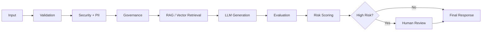
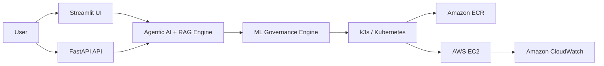

# -ML-Governance-AI-Observability-Platform
<div align="center">

# 🛡️ AI Governance Platform

### Continuous evaluation, monitoring, explainability, and governance for AI/ML systems in production

*Your model can be accurate today — and still become risky tomorrow.*

[](https://www.python.org/)
[](https://fastapi.tiangolo.com/)
[](https://streamlit.io/)
[](https://www.docker.com/)
[](https://aws.amazon.com/)
[](https://k3s.io/)
[](#-license)

[**🔗 Live Demo**](http://13.48.105.111:30080) · [Architecture](#-architecture) · [Tech Stack](#-tech-stack) · [Getting Started](#-getting-started) · [API Reference](#-api-reference) · [Deployment](#-deployment-on-aws)

</div>

---

## 📚 Table of Contents

- [Why This Exists](#-why-this-exists)
- [Architecture](#-architecture)
- [Core Capabilities](#-core-capabilities)
- [Tech Stack](#-tech-stack)
- [Project Structure](#-project-structure)
- [Getting Started](#-getting-started)
- [Configuration](#-configuration)
- [API Reference](#-api-reference)
- [Dashboard](#-dashboard)
- [Deployment on AWS](#-deployment-on-aws)
- [Observability](#-observability)
- [Testing](#-testing)
- [Troubleshooting](#-troubleshooting)
- [Roadmap](#-roadmap)
- [Contributing](#-contributing)
- [License](#-license)

---

## ⚡ Why This Exists

Production AI isn't just "does the model still predict well." Real production systems need to continuously answer:

| | Question |
|---|---|
| 📈 | Is the data drifting? |
| ⚠️ | Is model risk increasing? |
| ⚖️ | Is there a fairness issue? |
| 🤖 | Are the LLM's responses grounded? |
| 🛡️ | Did a security or PII issue occur? |
| 💰 | Is LLM usage becoming too expensive? |
| 📉 | Is performance degrading? |
| 👤 | Does this decision require human review? |
| 📝 | Can we trace what happened, later? |

Most teams answer these with disconnected tools — a monitoring dashboard here, an eval script there, a manual security review somewhere else. This project connects **monitoring, evaluation, security, and governance** into a single **agentic governance workflow**.

```
Generate → Evaluate → Govern → Monitor → Escalate
```

The core insight: **accuracy is necessary but not sufficient**. A model can score well on every offline metric and still be the wrong thing to trust in production if the input data has drifted, the decision affects a protected group unevenly, the LLM is hallucinating with confidence, or the request contains PII that should never have reached the model in the first place.

---

## 🏗️ Architecture



Every request flows through validation, security screening, and governance policy checks **before** it ever reaches generation — and every generated response is evaluated and risk-scored **before** it's returned. High-risk cases are automatically routed to human review instead of silently passing through.

### Deployment topology



---

## 🧠 Core Capabilities

### AI Engineering
- **LangChain** — LLM application orchestration
- **LangGraph** — Agentic workflow orchestration
- **RAG + Vector Database** — Grounded, semantic knowledge retrieval
- **LLM Evaluation** — Hallucination & groundedness checks
- **AI Guardrails** — Security, PII, and policy validation

### ML Governance
- **Drift Detection** — PSI, KS, Jensen-Shannon, Wasserstein distance
- **Model Evaluation** — Performance & prediction monitoring
- **Fairness & Bias** — Group-based model analysis
- **Explainable AI** — SHAP-based feature explanations
- **Risk Engine** — Automated risk scoring & governance decisions
- **Human-in-the-Loop** — High-risk cases routed for approval
- **Audit Trail** — Full governance event & decision history

---

## 🛠️ Tech Stack

<div align="center">

| Layer | Technologies |
|---|---|
| **AI / ML** | LangChain · LangGraph · RAG · Vector DB · SHAP · Scikit-learn |
| **App** | FastAPI · Streamlit · Python 3.13 |
| **Data / Tracking** | MLflow · SQLite |
| **Containers / Orchestration** | Docker · k3s / Kubernetes |
| **Cloud** | Amazon ECR · AWS EC2 · AWS Lambda · Amazon SNS |
| **Observability** | Amazon CloudWatch |

</div>

Key pinned dependencies (see `requirements.txt` for the full list):

```
numpy==2.1.3        pandas==2.2.3         scipy==1.14.1
scikit-learn==1.5.2  shap==0.48.0         joblib==1.4.2
fastapi==0.115.6     uvicorn==0.34.0      pydantic==2.10.6
langgraph==0.2.76    langchain-core==0.3.30
langgraph-checkpoint==2.0.10  langsmith==0.1.147
groq==1.7.0          boto3==1.35.81
streamlit==1.41.1    plotly==5.24.1       mlflow==3.16.1
```

---

## 📁 Project Structure

```
ai-governance-platform/
├── app/
│   ├── api/                 # FastAPI routes
│   ├── agents/               # LangGraph agentic workflow nodes
│   ├── governance/           # Risk engine, policy rules, audit trail
│   ├── evaluation/           # Groundedness / hallucination checks
│   ├── monitoring/           # Drift detection (PSI, KS, JS, Wasserstein)
│   ├── explainability/       # SHAP-based explanations
│   ├── security/             # PII detection & input guardrails
│   └── dashboard/             # Streamlit UI
├── deployment/
│   └── docker/
│       ├── Dockerfile.api
│       ├── Dockerfile.ui
│       └── Dockerfile.mlflow
├── k8s/                       # k3s / Kubernetes manifests
├── requirements.txt
├── Dockerfile
├── .env.example
└── README.md
```

> Adjust this tree to match your actual repo layout — this reflects the structure implied by the project's components.

---

## 🚀 Getting Started

### Prerequisites

- Docker Desktop (with BuildKit enabled)
- Python 3.13
- AWS CLI configured (only needed for deployment steps)
- An API key for your chosen LLM provider (e.g. Groq)

### Local setup — Docker (recommended)

```bash
# clone the repo
git clone https://github.com/<your-username>/ai-governance-platform.git
cd ai-governance-platform

# build the image (BuildKit cache mount speeds up rebuilds)
docker build -t ai-governance-platform .

# run it
docker run -p 8000:8000 -p 8501:8501 --env-file .env ai-governance-platform
```

- FastAPI service → `http://localhost:8000`
- FastAPI docs (Swagger UI) → `http://localhost:8000/docs`
- Streamlit dashboard → `http://localhost:8501`

### Local setup — without Docker

```bash
python3.13 -m venv .venv
source .venv/bin/activate      # Windows: .venv\Scripts\activate

pip install -r requirements.txt

# run the API
uvicorn app.api.main:app --reload --port 8000

# in a second terminal, run the dashboard
streamlit run app/dashboard/main.py
```

---

## ⚙️ Configuration

Create a `.env` file in the project root:

```env
# LLM provider
GROQ_API_KEY=your_groq_api_key

# AWS (for deployment / CloudWatch metrics)
AWS_ACCESS_KEY_ID=your_key
AWS_SECRET_ACCESS_KEY=your_secret
AWS_REGION=eu-west-1

# Vector DB
PINECONE_API_KEY=your_pinecone_key
PINECONE_ENVIRONMENT=your_environment

# Governance thresholds
RISK_ESCALATION_THRESHOLD=0.7
DRIFT_PSI_THRESHOLD=0.2

# MLflow
MLFLOW_TRACKING_URI=http://localhost:5000
```

> Never commit `.env` to version control — add it to `.gitignore` if it isn't already.

---

## 🔌 API Reference

The FastAPI service exposes governance-aware endpoints. Full interactive docs are available at `/docs` once running.

| Method | Endpoint | Description |
|---|---|---|
| `POST` | `/api/v1/generate` | Run a request through the full governance pipeline (validation → security → RAG → generation → evaluation → risk scoring) |
| `GET` | `/api/v1/drift/{model_id}` | Get current drift metrics for a model |
| `GET` | `/api/v1/risk/{request_id}` | Get the risk score and governance decision for a specific request |
| `POST` | `/api/v1/review/{request_id}` | Submit a human review decision for an escalated request |
| `GET` | `/api/v1/audit` | Query the audit trail |
| `GET` | `/health` | Health check |

Example request:

```bash
curl -X POST http://localhost:8000/api/v1/generate \
  -H "Content-Type: application/json" \
  -d '{"query": "Summarize the Q3 risk report", "user_id": "u123"}'
```

---

## 📊 Dashboard

The Streamlit dashboard surfaces:

- Real-time drift charts (PSI / KS / Jensen-Shannon / Wasserstein)
- Risk score distribution across recent requests
- SHAP feature explanations per prediction
- Fairness metrics broken down by protected group
- Human review queue for escalated requests
- Full audit trail, searchable by request ID or time range

---

## ☁️ Deployment on AWS

```
User → Streamlit / FastAPI → Agentic AI + RAG → ML Governance Engine
     → k3s / Kubernetes → Amazon ECR → AWS EC2 → CloudWatch
```

High-level deployment flow:

1. **Build & push** the Docker image to **Amazon ECR**.
2. **Provision** an EC2 instance (or use an existing one) with `k3s` installed.
3. **Deploy** the manifests in `k8s/` to the k3s cluster.
4. **Configure CloudWatch** as the metrics sink for the `AIGovernance` namespace.
5. **(Optional)** wire up **AWS Lambda + Amazon SNS** for automated alerting on risk/drift thresholds.

```bash
# example: build, tag, and push to ECR
aws ecr get-login-password --region <region> | docker login --username AWS --password-stdin <account>.dkr.ecr.<region>.amazonaws.com

docker build -t ai-governance-platform .
docker tag ai-governance-platform:latest <account>.dkr.ecr.<region>.amazonaws.com/ai-governance-platform:latest
docker push <account>.dkr.ecr.<region>.amazonaws.com/ai-governance-platform:latest

# apply k3s manifests
kubectl apply -f k8s/
```

**🔗 Live instance:** [http://13.48.105.111:30080](http://13.48.105.111:30080)

---

## 📡 Observability

Every request is traced end-to-end — validation, security checks, retrieval, generation, evaluation, and risk scoring are all logged to the audit trail and streamed to CloudWatch, so you can answer *"what happened, and why did the system decide what it decided"* well after the fact.

The `AIGovernance` CloudWatch namespace tracks:

📊 Latency &nbsp;·&nbsp; ⚠️ Risk &nbsp;·&nbsp; 📈 Drift &nbsp;·&nbsp; ❌ Errors &nbsp;·&nbsp; 🤖 LLM Usage &nbsp;·&nbsp; 💰 Cost

---

## 🧪 Testing

```bash
# run the test suite
pytest tests/ -v

# run with coverage
pytest tests/ --cov=app --cov-report=term-missing
```

> Add `pytest`, `pytest-cov`, and `httpx` (for FastAPI TestClient) to a `requirements-dev.txt` if not already present.

---

## 🩺 Troubleshooting

Common Docker build issues and fixes, learned the hard way:

| Symptom | Cause | Fix |
|---|---|---|
| `No matching distribution found` for a package that clearly exists on PyPI | Transient network failure during dependency resolution, not a real version conflict | Increase `--timeout`/`--retries`, retry the build |
| `Connection broken: IncompleteRead(...)` mid-download | MTU mismatch in Docker Desktop's WSL2 networking | Run `wsl --shutdown`, or set `networkingMode=mirrored` in `.wslconfig` |
| pip resolver backtracks all the way to ancient/broken package versions | Usually a symptom of intermittent metadata-fetch failures, not a genuine dependency conflict | Pin the suspect package to a modern version range (e.g. `flask-cors>=4.0.0,<7`) to prevent the resolver considering broken old releases |
| Builds take 15–20+ minutes and re-download everything on every retry | No persistent pip cache across failed builds | Use a BuildKit cache mount: `RUN --mount=type=cache,target=/root/.cache/pip pip install -r requirements.txt` |

---

## 🎯 Roadmap

- [ ] Stronger LLM evaluation metrics (faithfulness, relevance, toxicity)
- [ ] Expanded governance policy engine
- [ ] Deeper security & PII detection coverage
- [ ] Enhanced observability dashboards
- [ ] Autonomous remediation for common risk patterns

---

## 🤝 Contributing

Contributions are welcome. To propose a change:

1. Fork the repo and create a feature branch: `git checkout -b feature/my-feature`
2. Make your changes, with tests where applicable
3. Run the test suite and confirm everything passes
4. Open a pull request describing the change and why it's needed

Please open an issue first for larger changes so we can discuss the approach before you invest significant time.

---

## 📄 License

This project is licensed under the MIT License — see the `LICENSE` file for details.

---

<div align="center">

**Building an AI application is only the beginning.**
Production AI requires intelligence, evaluation, security, governance, explainability, observability, and human oversight — brought together into one platform.

---

`#AIGovernance` `#AIEngineering` `#AgenticAI` `#RAG` `#MLOps`

</div>
